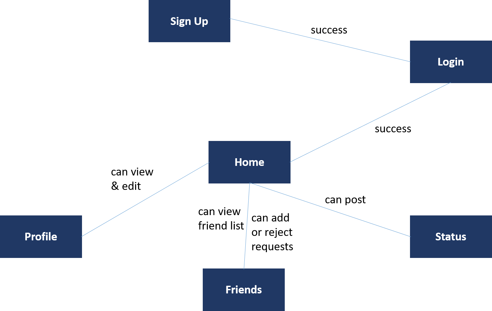
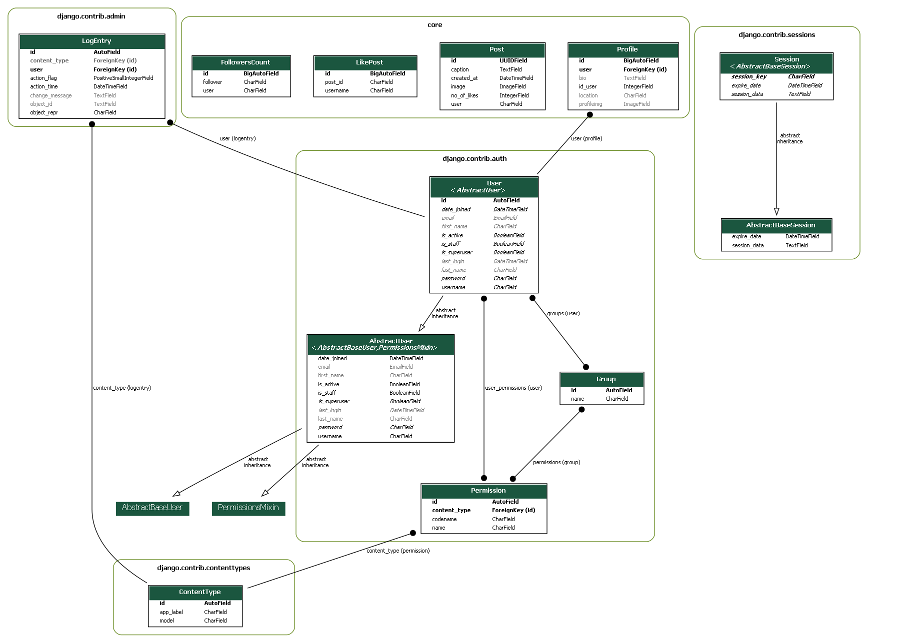

## Project Documentation
+ Project Documentation is provided below.

## Features
+ User
    + Mandatory Registration to access the site
    + Login (For Registered Users)
    + Logout (For Registered Users)
    + Edit Profile (For Registered Users)
      + valid username
      + valid email address
      + profile picture
      + bio
      + location
      
  
+ Admin
    + CRUD Operations
    
+ User Profile
    + Edit Profile
    + Reset Password  

+ Following
    + See posts
    + Like Posts
    + Users can search other users with a simple keyword
    

    
## Pages and navigation

## Technological considerations

+ Django 4.1.7
+ Python 3.10.5
+ Bootstrap 
+ Render
+ PostgreSQL 11

### App used
+ Core

### Needed Django models and their attributes
+ User Model
+ Profile Model
+ Post Model
+ LikePost Model
+ FollowersCount Model

## Simple Explanantion Diagram
 

### URIs
Completed URLS:

    
urlpatterns=[
  path('', views.index, name='index'),
  path('removepost',views.removepost, name='removepost'),
  path('signup', views.signup, name='signup'),
  path('signin', views.signin, name='signin'),
  path('logout', views.logout, name='logout'),
  path('settings', views.settings, name='settings'),
  path('upload',views.upload, name='upload'),
  path('like-post', views.like_post, name='like-post'),
  path('follow', views.follow, name='follow'),
  path('profile/<str:pk>', views.profile, name='profile'),
  path('gotoprofile', views.gotoprofile, name='profile'),
  path('search', views.search, name='search'),
  path('reset_password/', authViews.PasswordResetView.as_view(template_name= "registration/password_reset.html"), name="reset_password"),
  path('reset_password_sent/', authViews.PasswordResetDoneView.as_view(template_name= "registration/password_reset_sent.html"), name="password_reset_done"),
  path('password-reset-confirm/<uidb64>/<token>/', PasswordResetConfirmView.as_view(template_name='registration/password_reset_form.html'), name='password_reset_confirm'), 
  path('reset_password_complete/', authViews.PasswordResetCompleteView.as_view(template_name= "registration/password_reset_done.html"), name="password_reset_complete"),
  path('password-reset/', PasswordResetView.as_view(template_name='users/password_reset.html',html_email_template_name='users/password_reset_email.html'),name='password-reset'),
          ]

### Needed Django views and templates
+ Completed Functions Used :
    + index
    + settings
    + signin
    + upload
    + like_post
    + profile
    + follow
    + search
    + removepost
    

+ Completed Templates:
    + index.html
    + profile.html
    + search.html
    + setting.html
    + signin.html
    + signup.html
    + password_reset.html
    + password_reset_done.html
    + password_reset_email.html
    + password_reset_form.html
    + password_reset_sent.html
    
    

    
## Testing
+ Manual Testing

 

## HMKSocialHub Documentation
Table of Contents
+ General Details
+ Requirements
+  Configurations
+  Navigation
+ User
    + Login
    + Register
    + View profile
    + Edit profile
+ Timeline
    + Create status
+ Styling and UI components
    + Custom CSS
    
## General Guidelines
HMKSocialHub is a social networking app developed with Django  and Python  This web apps has smoother functionalities of following friends to your profile from a suggested user list. Also it lets you maintain your social profile and sharing your thoughts in the timeline.

## Requirements
To run the web app properly you need to follow the following requirements and have them installed in the virtual environment ( pip install -r requirements.txt ) .

+ asgiref==3.6.0
+ astroid==2.15.0
+ certifi==2022.12.7
+ charset-normalizer==3.1.0
+ cloudinary==1.32.0
+ colorama==0.4.6
+ dill==0.3.6
+ dj-database-url==1.2.0
+ Django==4.1.7
+ django-cloudinary-storage==0.3.0
+ django-environ==0.10.0
+ django-extensions==3.2.1
+ graphviz==0.20.1
+ gunicorn==20.1.0
+ idna==3.4
+ isort==5.12.0
+ lazy-object-proxy==1.9.0
+ mccabe==0.7.0
+ Pillow==9.4.0
+ platformdirs==3.1.1
+ psycopg2-binary==2.9.5
+ pydot==1.4.2
+ pylint==2.17.1
+ pyparsing==3.0.9
+ requests==2.28.2
+ six==1.16.0
+ sqlparse==0.4.3
+ tomli==2.0.1
+ tomlkit==0.11.6
+ typing_extensions==4.5.0
+ tzdata==2022.7
+ urllib3==1.26.15
+ whitenoise==6.4.0
+ wrapt==1.15.0

## Configurations

As mentioned earlier the web app requires Django 2.1 and Python 3.7. We have used PostGREsql database for this application. The version that was used in this app is PostGREsql 11 also pgAdmin version 4 is used while developing the product. 
The installed apps of the webapp as mentioned below.

    
INSTALLED_APPS = [
    'django.contrib.admin',
    'django.contrib.auth',
    'django.contrib.contenttypes',
    'django.contrib.sessions',
    'django.contrib.messages',
    'django.contrib.staticfiles',
    'cloudinary_storage',
    'cloudinary',
    'django_extensions',
    'django.contrib.humanize',
       
    
    'core',
]

The media root of the package is set as follows:

MEDIA_ROOT = os.path.join(BASE_DIR, 'media')

MEDIA_URL = '/media/'

#Navigation
At the very beginning the app will direct you to signin into app. You can login to the app using your username and password. But it requires you to create an account in the apps first. So you can access to the signup page from there to create an account. Then you can access to your profile after login. There you can also edit your profile. You can then see the other users in the users suggestion list and follow them, You can also update your status with the rest of your friends.

## User

The user app has all the functionalities like login, signup, viewing profile and editing   profile. The proper usage of the app comes with the initial usage of the app. The very beginning the app routes user to login in the app. The app used Django’s in built auth form in order to ensure the security of the user.

   + Login:
   
   In the login page user have to give the username and the password of the user in order to access to the web app. If the user does not have any account in the web app, they can access the sign up page from there using the sign up link just below the sign in form
+ Register
    + In the sign up page the user have to register himself to the web app. For that the user have to give some information in the very beginning. The user must have to provide the following info.
      + Username
      + Password

  + The requirements of providing password is as follows:
    + Your password must contain at least 8 characters.
    + Your password cannot be a commonly used password.

+ View profile

In the view profile page you can view the information you have listed. To update the information you have provided you can click on the account settings button below and this will take you to the settings page.  

 

+ Update status 

In the update status the user can give the content of the status and click the post button. The contents will be posted to the timeline of the user. The Content bears some cool functionalities like time and date of the date that post along with all the users information.

## Styling and UI components
For styling the web app we have used standard CSS that can be accessed in the main.css file. We have used the Bootstrap 4 UI components like button, navigation bar, form components and menu bar components. There are some custom CSS also that were used in the app.

